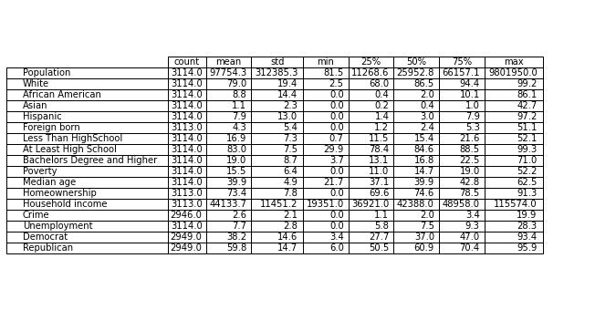

# Political-Affiliation-Determinants
 Exploring factors influencing political affiliation in US through data analysis and modeling in Python
# Introduction 
Understanding the factors that shape political affiliation is crucial for gaining insights into the diverse dynamics of American society. The topic is relevant to current political discourse and its potential to shed light on how demographic and socio-economic factors influence voter behavior. The goal of this project is to explore the determinants of political affiliation across U.S. states and counties. Using data sourced from the United States Census Bureau and the Harvard Dataverse, I compiled a dataset comprising 3,114 observations. This dataset includes key determinants such as population characteristics and socio-economic conditions that may influence political preferences. By analyzing the dataset using Python, this project aims to uncover patterns and relationships that shape the political dynamics across different regions, providing valuable insights into the factors driving political behavior.

The dataset contains a wide range of covariates about U.S. counties, including population size, racial distribution, age demographics, education levels, income, unemployment rates, and more. The primary objectives are to conduct a comprehensive exploration of the dataset to understand its structure, uncover patterns, and identify relationships, and to apply statistical techniques to derive meaningful insights.

# Data Cleaning and Exploratory Data Analysis
The data exploration and cleaning phase involved merging population data from the 2019 American Community Survey with voting data from the same year. The data was standardized to ensure consistency, with most variables expressed as percentages to facilitate meaningful comparisons across counties of varying sizes. Key preprocessing steps included handling missing values by replacing numeric missing entries with their mean values and removing categorical entries with missing values. The dataset was further processed by converting political affiliation categories into a binary format, mapping "Democrat" to 1 and "Republican" to 0, making it suitable for statistical and machine learning analyses.

Exploratory Data Analysis was performed using Python libraries such as pandas, numpy, seaborn, and matplotlib to understand the dataset's structure and relationships. Summary statistics were computed to identify central tendencies and variations across counties. Visualization techniques, including pair plots, box plots, bar charts, and heatmap were used to explore how different variables correlated with political affiliation. 

# Statistical Analysis and Modeling
To further analyze the data, hypothesis testing and statistical modeling techniques were applied. Linear regression was employed to analyze the factors affecting political affiliation, with multicollinearity checked using Variance Inflation Factor (VIF). High multicollinearity prompted the removal of certain variables and the application of transformations such as logarithms and interaction terms to improve model performance. The final model achieved an R² of 54.2%, indicating a moderate explanatory power. Given the complexity of human behavior and social phenomena, this level of explanatory power is considered reasonable. This suggests that while the model does not capture the entirety of the variation in political affiliation, it still provides meaningful insights into key determinants. Linear regression predictions aligned well with actual data, as shown in scatter plots of predicted vs. actual values.

In addition to linear regression, logistic regression was applied to classify counties as Democratic or Republican based on socio-economic and demographic factors. Using sklearn and statsmodels, the logistic regression model achieved an accuracy of 84.53% through 15-fold cross-validation, demonstrating its robustness. The model provided insights into significant predictors of political affiliation, such as education and racial diversity, while logarithmic scaling was applied to variables like population to improve interpretability.

# Conclusion and Insights
Overall, the project successfully analyzed the determinants of political affiliation using a combination of data preprocessing, visualization, hypothesis testing, and predictive modeling. The findings provide valuable insights into the factors driving political behavior across U.S. counties, with potential applications in policy-making and electoral strategy development. The analysis revealed that variables such as population size, education levels (Bachelors Degree and Higher), racial composition (African American and Asian populations), and homeownership rates were significant determinants of political affiliation. Specifically, greater population, higher education levels and greater racial diversity were positively associated with Democratic affiliation, while homeownership rates were negatively correlated. Future improvements could involve incorporating additional socio-political variables and exploring more advanced machine learning techniques to enhance prediction accuracy.
